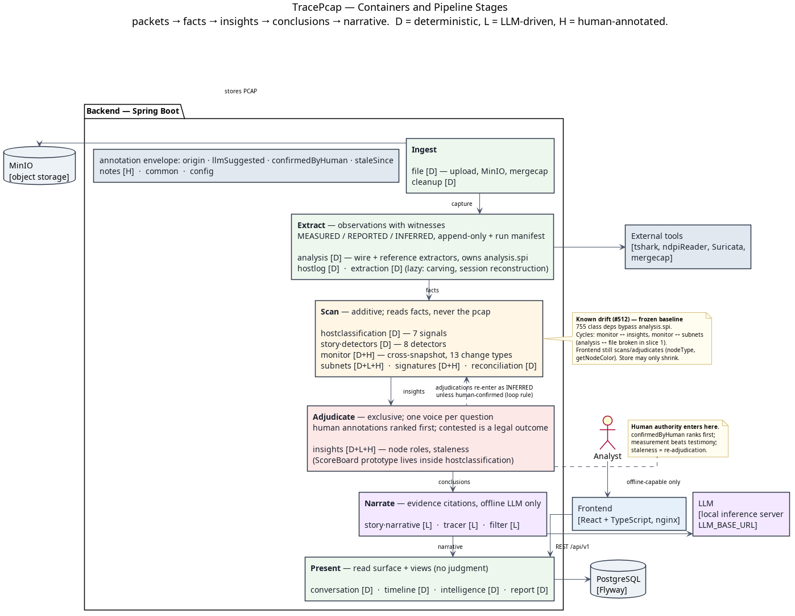

The Five-Stage Pipeline
=======================

TracePcap is a modular wrapper around a growing suite of functions. The architecture exists so
that new capability is added by **dropping a module into a stage**, not by editing a core. Every
boundary below was admitted under one test:

   *A stage boundary earns its existence only if modules can be added on one side without touching
   the other side.*

Stages follow the order data changes shape — packets → facts → insights → conclusions →
narrative:

.. code-block:: text

   Ingest → Extract → Scan → Adjudicate → Narrate        Present = the read surface over all
              │          │        │
              │          │        └─ exclusive: one adjudicator per question;
              │          │           human annotations enter here, ranked first;
              │          │           "contested" is a legal, displayable outcome
              │          └─ additive: scanners derive insights from facts;
              │             contradiction between facts is itself a finding
              └─ observations with witnesses: append-only, conflict-preserving,
                 graded MEASURED / REPORTED / INFERRED, plus a run manifest

**Determinism is not a stage.** Every stage contains deterministic (D), LLM-driven (L), and
human-annotated (H) capabilities; the tier is tagged per capability. Prefer D — an LLM must earn
its place by doing something determinism cannot, not by being easier to write.

.. contents::
   :local:
   :depth: 2

   Containers and backend stages. Regenerate with
   ``plantuml docs/architecture/c4-container.puml``.

Stage contracts
---------------

Ingest
~~~~~~

Capture in, bytes stored, analysis scheduled. Byte-level plumbing (merge, checksum, retention)
belongs here — including external tools that manipulate captures without reading into them
(``mergecap`` in ``FileServiceImpl``).

*Add a module when:* a new way for captures to arrive or be prepared (windowed ingest, dedup,
capture-quality assessment — truncation, clock skew, one-sidedness — feeding the manifest).

Extract
~~~~~~~

Digs every available fact out of the capture. **Deterministic, and its records are definitive**:
each fact is an *observation with a witness* — what was observed, where (frame/protocol), when,
by which extractor at which version.

Three grades, fixed per fact *type* at schema level:

.. list-table::
   :header-rows: 1
   :widths: 14 50 36

   * - Grade
     - What it is
     - Examples
   * - MEASURED
     - A property of the traffic itself. Nothing "said" it; it was exhibited.
     - byte counts, timestamps, ports, observed TTL, who sent SYN
   * - REPORTED
     - Content asserted by a network party. The assertion *event* is measured; the assertion
       *content* is testimony from an untrusted party.
     - DHCP hostname, NBNS name, HTTP User-Agent, TLS cert subject
   * - INFERRED
     - A third-party tool's judgment — deterministic to run, but heuristic, with known error
       modes.
     - nDPI app identification, Suricata alerts, GeoIP/OUI lookups

Rules:

* **Append-only; no winner-picking at write time.** Two conflicting hostname claims are both
  stored. Conflicts are resolved downstream (Adjudicate) and detected as findings (Scan) — a
  claim erased at write time can never be scanned. ``IpMacObservationEntity`` is the pattern done
  right; ``HostnameResolverService`` (picks a winner by source priority, discards the rest) is the
  pattern done wrong — see :ref:`divergence`.
* **Run manifest.** Every extractor reports its own status per file — ran / failed / partial,
  facts produced, extractor version. Downstream must consult it: "nDPI didn't run" and "nDPI ran
  and couldn't identify" are different states (the #501 bug is exactly this conflation).
  Versioned provenance also enables **backfill**: when an extractor is added or fixed, the
  manifest says exactly which files to re-run.
* **Two sub-kinds.** *Wire extractors* read the capture (``PcapParserService``, ``NdpiService``,
  ``HostnameResolverService``, hostlog extractors). *Reference extractors* join extracted facts
  against bundled reference data (GeoIP, OUI) — they need no pcap access and can backfill after
  the capture has been aged out.
* **Extraction may be lazy.** Session reconstruction and file carving read the pcap on demand;
  they are Extract-stage work triggered late, not exceptions to the rule.
* **The capture caveat.** Even MEASURED facts are definitive about *the capture*, not *the
  network* — drops, truncation, and one-sided flows mean absence of a fact is never evidence of
  absence.

*Add a module when:* there is a protocol or edge case to mine — deliberately the widest surface.
One protocol quirk = one extractor = zero downstream changes. (LLMNR #511, 802.1Q #464, DHCPv6,
Kerberos, SMB, SNMP sysDescr, per-flow entropy #501/#505, JA4 …)

Scan
~~~~

Reads the fact base — **never the pcap** — and derives insights: judgments with confidence and
reasons. Scanners are **additive**: a new scanner never conflicts with an existing one; it just
adds insights.

Rules:

* **Judgment is the boundary.** Deterministic recombination with nothing to contest (timeline
  bins, protocol breakdowns, top-hosts tables) is a *view*, not an insight — views live with
  Present and are never adjudicated.
* **Contradiction scanners are a first-class family.** In this product, fact conflicts are
  findings, not QC noise: ARP spoofing *is* an IP/MAC conflict; impersonation *is* a
  hostname-vs-certificate conflict. Severity follows the grades — two REPORTED facts disagreeing
  is mild; REPORTED contradicting MEASURED is where attacks live.
* **Scope is an attribute, not a stage**: per-capture (beacons, fan-out) or cross-snapshot
  (pattern-of-life, drift, convention learning #507).
* **The loop rule.** Cross-snapshot scanners may consume adjudications (device identity survives
  IP churn only as an adjudicated question), making the pipeline iterative, not a strict DAG. A
  scanner consuming an adjudication treats it as INFERRED **unless human-confirmed** — machine
  conclusions inform but never self-reinforce at full weight (the #507 circularity guard, made
  structural).

*Add a module when:* facts can be combined into a judgment (centrality #503, volumetric z-scores
#505, unknown-traffic characterisation #501, port-scan/exfil detectors, slow beacons #504).

Adjudicate
~~~~~~~~~~

Answers questions with one voice. Where scanners are additive, adjudicators are **exclusive**:
one adjudicator per question ("what is this host?", "what is its name?", "which subnet?"), and
adding a second for the same question is a conflict, not an addition.

Contract: consume competing insights **and human annotations as ranked inputs — human confirmed
first**; weigh by fact grade (measurement beats testimony); produce a winner with confidence
**or an explicitly contested outcome** — contested is legal, displayable, and narratable.
Conclusions are **versioned and revisable**: when underlying facts change, re-adjudication fires —
``staleSince`` is not a bolt-on, it *is* this mechanism.

``ScoreBoard`` (weighted votes → winner + margin confidence) is the working micro-prototype,
currently living only inside device classification. #499's conflicting-identity bug is the
absence of a host-identity adjudicator; #498 ("surface uncertainty") is simply exposing the
adjudication margin.

*Add a module when:* a new question domain needs one voice (host identity #499, hostname #511,
device type with user evidence #506, subnet membership #502).

Narrate
~~~~~~~

Turns insights into prose a human can act on. LLM-driven, always offline-capable
(``LLM_BASE_URL`` → local inference server; no hosted APIs).

Contract: narrators emit **evidence references** with every claim; a deterministic citation
checker verifies the references resolve to real facts. ``InvestigationService``'s
hypothesis → query → evidence loop is halfway to this already.

*Add a module when:* a new narrative product is needed (cross-snapshot stories #504, comparative
"what changed" narratives, report templates).

Present
~~~~~~~

The thin read surface: REST API, views (the no-judgment aggregations from the Scan rule),
rendering, export. **Present consumes adjudications; it never makes them** — see
:ref:`divergence` for where the frontend currently violates this.

*Add a module when:* a new way to see or export what the pipeline already knows (timeline-union
diagrams #510, heatmaps #505, tiered layout #509, evidence export).

The annotation envelope
-----------------------

Annotation is **not a stage** — it is the envelope on everything. A human can annotate at every
altitude: correct an extracted hostname, override a classification, confirm a subnet label,
dismiss a narrative finding. Every fact and every conclusion carries:

.. code-block:: java

   private String origin = "MANUAL";      // MANUAL | AI | CARRIED_FORWARD
   private boolean llmSuggested;
   private boolean confirmedByHuman;
   private LocalDateTime staleSince;      // + staleFields

``NodeRoleEntity`` is the reference implementation: the machine proposes, the human disposes,
provenance is retained, and the label goes stale when the evidence beneath it moves. Human
annotations get their authority at Adjudicate (ranked first), and ``confirmedByHuman`` data is
the **only** kind that feeds back into scanning at full weight.

New annotation surfaces must reuse this shape. Where they have not, the cost is visible: device
classification has no override path at all while ``signatures.yml`` carries a separate,
incompatible one (#506).

A worked example
----------------

*10.0.0.66 DHCP-declares itself "DC-01". The real domain controller is 10.0.0.10.*

.. list-table::
   :header-rows: 1
   :widths: 14 86

   * - Stage
     - What happens
   * - Ingest
     - The capture lands, is checksummed and queued.
   * - Extract
     - The DHCP extractor records the announcement (REPORTED, frame 812). The TLS extractor
       records 10.0.0.10's certificate CN=DC-01 (REPORTED, cryptographically backed). Traffic
       extractors record both hosts' behaviour (MEASURED). All three observations stored,
       append-only — no winner picked. The manifest shows every extractor ran clean.
   * - Scan
     - The identity-conflict scanner sees two hosts claiming one name, one claim contradicting a
       certificate → insight "possible impersonation, HIGH", citing both frames. The traffic
       scanner notes 10.0.0.66's MEASURED behaviour (fresh MAC, client-like pattern) does not
       match a domain controller.
   * - Adjudicate
     - The hostname adjudicator, weighing certificate above DHCP testimony, gives 10.0.0.10 the
       name ``DC-01`` and marks 10.0.0.66 **contested**. If an analyst had pinned 10.0.0.10 as
       the DC, that annotation enters ranked first and widens the margin.
   * - Narrate
     - "10.0.0.66 announced the domain controller's name 12 minutes after joining the network;
       certificate evidence contradicts the claim" — each clause citing frames, references
       verified by the citation checker.
   * - Present
     - The graph renders 10.0.0.66's label as contested (⚠), not as a confident lie. NodeDetails
       lists all three claims with sources.

Under the current code this attack is **invisible**: ``HostnameResolverService`` picks one name
at write time and discards the rest, so the conflict never exists for anything downstream to
find.

The slow-burn beacon (#504) runs the same rails at cross-snapshot scope: one connection per
capture is nothing; facts and manifest persist; a cross-snapshot scanner — consuming adjudicated
device identity per the loop rule — sees the same pair at the same hour across nine snapshots and
emits a periodicity insight no single capture could contain.

Modules by stage
----------------

Twenty backend modules under ``com.tracepcap``, placed by centre of gravity. Tier key:
``D`` deterministic · ``L`` LLM-driven · ``H`` human-annotated.

.. list-table::
   :header-rows: 1
   :widths: 14 22 10 54

   * - Stage
     - Module
     - Tier
     - Notes
   * - Ingest
     - ``file``
     - D
     - Upload, MinIO storage, merge (``mergecap``), lifecycle.
   * - Ingest
     - ``cleanup``
     - D
     - Retention and disposal.
   * - Extract
     - ``analysis``
     - D
     - The 7-stage orchestrator + wire extractors (``PcapParserService``, ``NdpiService``,
       ``TsharkEnrichmentService``, ``SuricataService``, ``HostnameResolverService``) + reference
       extractors (``GeoIpService``). Owns ``analysis.spi``. Lazy extraction:
       ``SessionReconstructionService``.
   * - Extract
     - ``hostlog``
     - D
     - Per-host service-log extractors (DNS, HTTP). ``WebServerLogExtractor`` currently also
       *scans* (the api/web role decision) — see :ref:`divergence`.
   * - Extract
     - ``extraction``
     - D
     - Lazy extraction: file carving. Its read API is Present.
   * - Scan
     - ``hostclassification``
     - D
     - 7 ``DeviceClassificationSignal`` scanners. Contains ``ScoreBoard`` — an Adjudicate
       prototype embedded in a Scan module.
   * - Scan
     - ``story`` *(detectors)*
     - D
     - 8 per-capture scanners: beacon, volume, fan-out, TLS anomaly, unknown app, …
   * - Scan
     - ``monitor``
     - D + H
     - Cross-snapshot scanner (``ChangeDetectionService``, 13 change types); snapshots are
       Ingest-adjacent; baselines are annotations consumed at Scan.
   * - Scan
     - ``subnets``
     - D + L + H
     - Density detection (D); LLM label suggestion (L); manual confirm (H).
   * - Scan
     - ``signatures``
     - D + H
     - User-authored rules (``signatures.yml``) — a data-driven scanner: plugin surface without
       code.
   * - Scan
     - ``reconciliation``
     - D
     - Cross-source identity reconciliation.
   * - Adjudicate
     - ``insights``
     - D + L + H
     - Node roles + ``LabelStalenessService`` — the nearest existing thing to an adjudicator, and
       home of the annotation reference pattern.
   * - Narrate
     - ``story`` *(narrative)*
     - L
     - ``StoryService``, ``InvestigationService``.
   * - Narrate
     - ``tracer``
     - L
     - LLM-assisted conversation tracing.
   * - Narrate
     - ``filter``
     - L
     - NL → display filter. Validates generated filters against the pcap — a grey case, see
       :ref:`divergence`.
   * - Present
     - ``conversation``
     - D
     - Conversation read API; raw-frame export (evidence export, not fact derivation).
   * - Present
     - ``timeline``
     - D
     - Views (time-binned aggregation — no judgment).
   * - Present
     - ``intelligence``
     - D
     - Views (clusters, top hosts, service summaries).
   * - Present
     - ``report``
     - D
     - PDF/report generation.
   * - envelope
     - ``notes``
     - H
     - Free-text annotation.
   * - —
     - ``common``, ``config``
     - —
     - Cross-cutting; depended on by everything, depend on nothing.

Dependency rules
----------------

#. **Feature → analysis, never the reverse** (#416). The pipeline owns ports (``analysis.spi``);
   feature modules implement them.
#. **Cross the boundary through the seam** — ``analysis.spi`` / ``analysis.dto``, never
   ``analysis`` repositories or entities.
#. **No cycles between modules.**
#. **Raw-capture access is confined** to Ingest byte-plumbing, Extract (eager or lazy), and
   evidence export. Everything else reads the database. If a scanner needs new raw data, that is
   a missing extractor — not a licence to shell out.
#. ``common`` and ``config`` are depended on by everything and depend on nothing.

All four are enforced (frozen) by ArchUnit — see :doc:`enforcement`.

.. _divergence:

Known divergence
----------------

Measured against the model above; frozen in the ArchUnit baseline where enforceable. Each entry
is a refactor target, not a shrug.

* **755 class dependencies** bypass ``analysis.spi`` and reach into ``analysis`` repositories or
  entities (rule 2). Rule 1 holds at **zero** violations. **Module cycles: zero** — three were
  eliminated across slices 1 and 3: ``analysis ↔ file`` (listener moved to its consumer),
  ``monitor ↔ insights`` and ``monitor ↔ subnets`` (a ``monitor.spi`` port package —
  ``LabelStalenessCheck``, ``SnapshotRevalidationHook``, ``InsightPresence`` — implemented by
  ``insights``/``subnets``, plus ``NodeRoleChangedEvent`` relocated to ``common.event`` as shared
  vocabulary, since publisher and consumer sit on opposite sides of the Scan/Adjudicate loop).
  Lesson kept for posterity: ArchUnit's cycle enumeration understates until the last cycle is
  gone — ``monitor ↔ subnets`` only surfaced after ``analysis ↔ file`` was fixed.
* **Hostname claims are now conflict-preserving** (slice 4): ``HostnameResolverService`` records
  every claim into ``hostname_claims`` (V33), and ``HostnameAdjudicator`` picks the display winner
  with the old semantics — same winners, but losing claims survive, so #511's identity-conflict
  scanners finally have evidence to read. The adjudicator is hosted in ``analysis`` until a
  dedicated Adjudicate module exists (``analysis`` must not depend on feature modules — frozen
  rule). Contested IPs are counted and logged; surfacing them as findings and UI state is #511's
  work.
* **``WebServerLogExtractor`` mixes stages** — extraction (endpoint logging) and scanning (the
  api/web role decision that #496 flags as broken) in one pass.
* **Run manifest exists for nDPI only** (slice 2): ``extraction_runs`` records
  COMPLETED/FAILED/SKIPPED per file, served through the ``ExtractionManifest`` SPI port, and
  ``UnknownAppDetector`` now reports a skipped/failed run as a ``COVERAGE_GAP`` finding instead
  of *"100% of Traffic Has Unknown Application, HIGH"* (#501). Remaining extractors (tshark
  enrichment, Suricata when it runs, hostname resolution, service logs) are not yet
  instrumented — their absent rows mean "unknown provenance", same as pre-manifest files.
* **The frontend scans and adjudicates.** ``networkService.ts`` computes ``nodeType`` from
  ports/nDPI (scanning) and ``getNodeColor`` resolves the nodeType-vs-deviceType conflict by
  display precedence (adjudicating) — client-side, on a truncated node set. #496/#499 are the
  predictable symptoms. The fix direction: these decisions move behind the API; Present consumes
  adjudications.
* **No adjudicators exist** outside ``ScoreBoard``'s embedded prototype; conclusions ship to the
  UI un-reconciled (#499), and confidence is buried in a click-through popup (#498).
* **``FilterService`` reads the pcap** to validate LLM-generated filters — the one grey case in
  rule 4, baselined rather than blessed.
