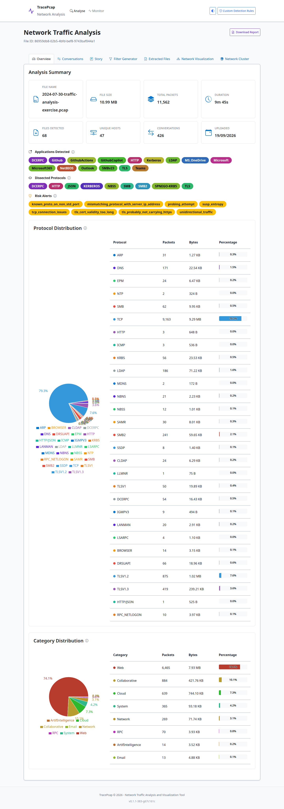
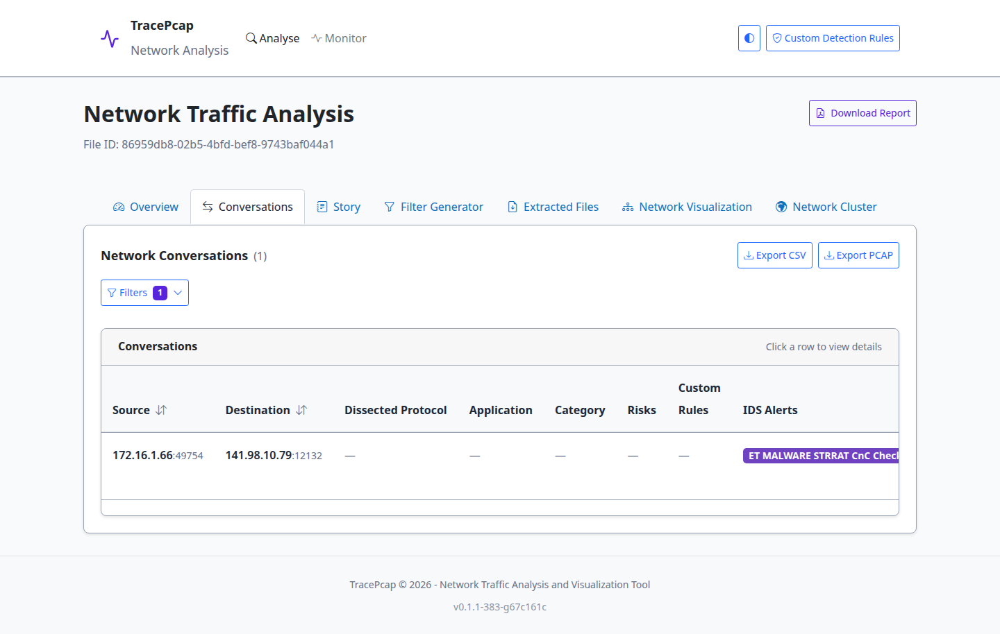
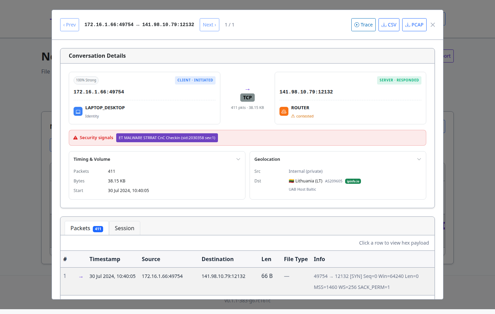
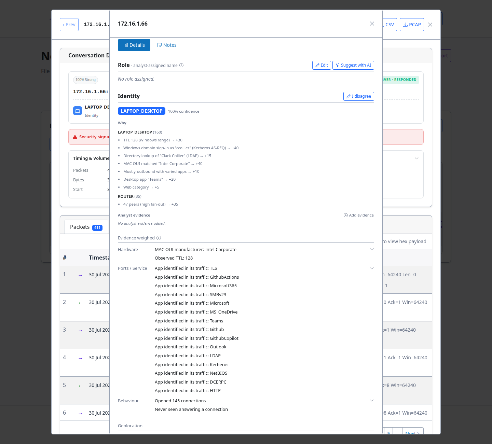
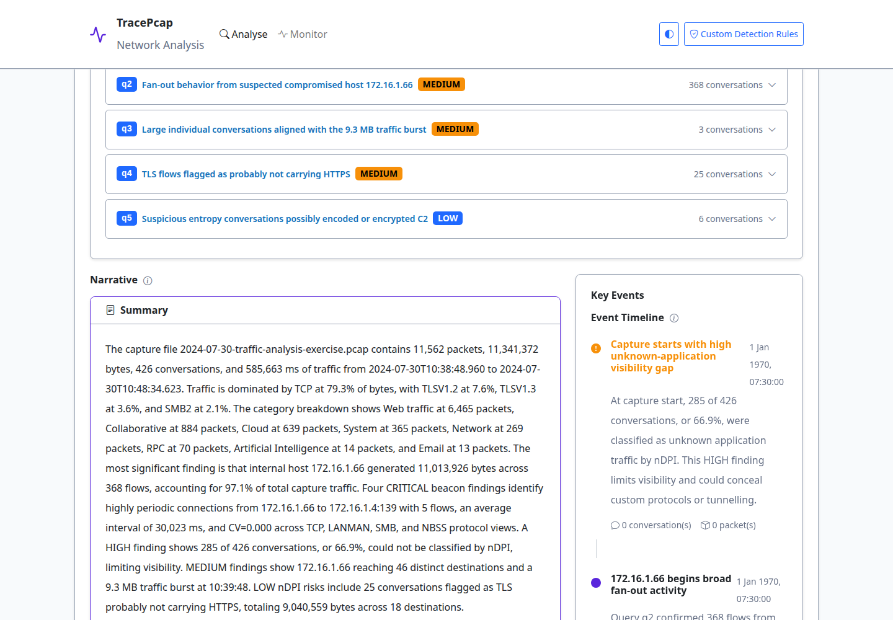

STRRAT infection — "You dirty rat!"
====================================

This walkthrough runs a real, publicly available network-forensics incident through TracePcap's
*existing* features, end to end. It works the way an analyst would: from the captured traffic alone,
with no prior knowledge of the network, and cross-checks every result against the exercise's own
official answer key.

.. note::

   Nearly everything here comes from TracePcap's **deterministic** layers — Suricata, nDPI, the host
   classifier, and the Kerberos/LDAP identity extractor. The LLM "Story mode" narrative appears last,
   as a layer *on top* of those findings, not the source of them. That distinction is the point of the
   demo: the ground truth is deterministic and reproducible.

The exercise
------------

`malware-traffic-analysis.net <https://www.malware-traffic-analysis.net/>`_ publishes real malware
traffic as training exercises: a packet capture from a realistic, simulated corporate infection, a
short scenario prompt, and an answer key. Analysts download the capture and practice incident response
from network data alone.

The scenario here is the `2024-07-30 "You dirty rat!" exercise
<https://www.malware-traffic-analysis.net/2024/07/30/index.html>`_. The title is a pun — the malware is
a **RAT** (Remote Access Trojan), specifically **STRRAT**, a Java-based commodity RAT that provides
remote control, keylogging, and credential theft. It was delivered as an **email attachment**, so the
loader itself is out of band; the capture contains only the **post-infection network traffic** — which
is exactly the black-box situation TracePcap is built for.

What you are given
------------------

The exercise hands the analyst the environment and the task, and nothing else — everything else has to
be recovered from the capture.

**Scenario briefing (the simulated corporate LAN):**

.. list-table::
   :header-rows: 1
   :widths: 32 68

   * - Given
     - Value
   * - LAN subnet
     - ``172.16.1.0/24``
   * - Active Directory domain
     - ``wiresharkworkshop.online``
   * - Domain controller
     - ``172.16.1.4`` (``WIRESHARK-WS-DC``)
   * - The task
     - Identify the infected host and its details (IP, MAC, hostname, the logged-in user), the malware
       family, and the command-and-control server — i.e. write the incident report.

**The capture itself is not committed to this repository.** Third-party incident archives can carry
live malware samples, so they stay out of git by policy. Download it from the source instead:

- Page: https://www.malware-traffic-analysis.net/2024/07/30/index.html
- The capture ZIP is password-protected. malware-traffic-analysis.net uses a fixed scheme,
  ``infected_YYYYMMDD`` where the date is the post date — so this one is ``infected_20240730``.

Everything below is what TracePcap recovers, starting from just that briefing and the ``.pcap``.

Walking it through TracePcap
----------------------------

Step 1 — Upload and analyse
~~~~~~~~~~~~~~~~~~~~~~~~~~~~~

Upload the ``.pcap`` through the normal :doc:`upload flow </features/pcap-upload>`. A single
deterministic pipeline runs on ingest — packet dissection, nDPI application identification, Suricata
(Emerging Threats ruleset), host classification, and the Kerberos/LDAP identity extraction. No LLM is
involved in any of it. When analysis completes, every view below is populated.

Step 2 — Overview: the shape of the capture
~~~~~~~~~~~~~~~~~~~~~~~~~~~~~~~~~~~~~~~~~~~~~

The **Overview** tab is the landing summary: 11,562 packets across 47 hosts and 426 conversations, the
protocol mix, the applications nDPI identified, and a row of risk-alert badges. Two protocols worth
noting immediately are **KRB5** (Kerberos) and **LDAP** — the directory-service traffic that will name
the victim.

   The Overview tab: inventory, protocol distribution (note KRB5 and LDAP), detected applications, and
   nDPI risk alerts.

Step 3 — Threat detection: naming the malware and its C2
~~~~~~~~~~~~~~~~~~~~~~~~~~~~~~~~~~~~~~~~~~~~~~~~~~~~~~~~~~~

TracePcap runs Suricata automatically, so the family is named without any manual pcap digging. In the
**Conversations** tab, filtering to the destination ``141.98.10.79`` leaves a single flow — and its IDS
Alerts column already carries the verdict:

   One conversation, ``172.16.1.66:49754 → 141.98.10.79:12132``, flagged **"ET MALWARE STRRAT CnC
   Checkin"** (sid 2030358).

So from the capture alone we already have the malware family (**STRRAT**), the **C2 endpoint**
(``141.98.10.79:12132``), and the infected host (``172.16.1.66``).

Step 4 — Conversation detail: the full picture of the C2 channel
~~~~~~~~~~~~~~~~~~~~~~~~~~~~~~~~~~~~~~~~~~~~~~~~~~~~~~~~~~~~~~~~~~~~

Opening that conversation shows both endpoints in context: the client ``172.16.1.66`` classified as a
laptop/desktop, the server as an external host, the Suricata security signal restated, and — via the
offline GeoIP database — the C2's location.

   The C2 channel in full: the STRRAT security signal, GeoIP placing ``141.98.10.79`` in Lithuania
   (UAB Host Baltic), and the raw packet list.

Step 5 — Host identity: recovering the person at the keyboard
~~~~~~~~~~~~~~~~~~~~~~~~~~~~~~~~~~~~~~~~~~~~~~~~~~~~~~~~~~~~~~~~

Clicking the victim host opens its identity panel — and this is the capability the demo motivated
(see :doc:`/features/windows-identity`). The exercise's own answer key recovers the user's identity by
hand, filtering LDAP for a ``givenName`` attribute. TracePcap now does it automatically: it reads the
client's own **Kerberos AS-REQ** (``ccollier`` authenticating) and the **LDAP directory lookup** of
that account (``CN=Clark Collier,CN=Users,DC=…``), and folds both into the host's classification
evidence.

   ``172.16.1.66`` → LAPTOP_DESKTOP, with the *Why* breakdown naming the user: **Windows domain
   sign-in as "ccollier" (Kerberos AS-REQ) → +40** and **Directory lookup of "Clark Collier" (LDAP)
   → +15**.

The Kerberos claim is the stronger of the two — the client authenticated *as* that principal — so it
weighs more than the LDAP directory lookup, which merely names an account someone queried. The domain
controller (``172.16.1.4``) is deliberately **not** credited with a signed-in user, and machine
accounts (``DESKTOP-SKBR25F$``) are excluded, so no computer object is ever mistaken for a person.

.. tip::

   The same sign-in also appears as a **Signed-in user** attribute on the host in the Network
   Visualization view, next to its passively-discovered hostname, with a badge showing whether the
   name came from Kerberos or LDAP.

Step 6 — Behaviour: the beacon and the top-talker
~~~~~~~~~~~~~~~~~~~~~~~~~~~~~~~~~~~~~~~~~~~~~~~~~~~

TracePcap's behavioural analysis adds shape to the picture, independent of any signature:

- **A textbook beacon.** A CRITICAL periodic-connection finding fires on
  ``172.16.1.66 → 172.16.1.4:139`` (SMB/NetBIOS): five flows, ~30,023 ms average interval, coefficient
  of variation **0.000** — zero jitter, a machine keeping time, not a human.
- **Top-talker and fan-out.** ``172.16.1.66`` initiated 368 flows to 46 distinct destinations and
  produced **97.1%** of all bytes in the capture.
- **An honest visibility gap.** 66.9% of conversations (285 of 426) could not be classified by nDPI —
  TracePcap surfaces this as a HIGH finding rather than pretending to full coverage.

Step 7 — Story mode: a narrative layer, and its limits
~~~~~~~~~~~~~~~~~~~~~~~~~~~~~~~~~~~~~~~~~~~~~~~~~~~~~~~~~

With a local LLM configured (see :doc:`/configuration/llm-setup`), Story mode writes a SOC-style
narrative from the analysis, and even runs its own follow-up investigation queries to confirm each
hypothesis against the data.

   Story mode: the LLM's investigation queries (q2–q5) and the generated narrative, grounded in the
   deterministic findings.

.. important::

   The narrative correctly centres the investigation on ``172.16.1.66``, the SMB beacon, the 9.3 MB TLS
   burst, and the directory-service access — but, working from traffic *metrics*, it never named the
   actual STRRAT C2 (``141.98.10.79``) or the victim ``ccollier``. Those came only from the
   deterministic layers. This is the demo's closing point: the LLM is a helpful narrator, not the
   detector — anchor conclusions in the signature hits and extracted facts beneath it.

Artifacts recovered
-------------------

From one upload, with no prior knowledge of the network, TracePcap surfaced:

.. list-table::
   :header-rows: 1
   :widths: 20 44 36

   * - Question
     - Answer
     - How TracePcap found it
   * - Who?
     - ``ccollier`` (Clark Collier)
     - Kerberos AS-REQ + LDAP directory lookup (host identity)
   * - What?
     - STRRAT (Java RAT)
     - Suricata: "ET MALWARE STRRAT CnC Checkin"
   * - Where (C2)?
     - ``141.98.10.79:12132`` (Lithuania)
     - Suricata signature + offline GeoIP
   * - Which host?
     - ``172.16.1.66`` — Windows laptop/desktop, ``DESKTOP-SKBR25F``, Intel NIC
     - Host classification (TTL, OUI, apps, sign-in)
   * - How does it behave?
     - 30-second zero-jitter beacon; 97.1%-of-bytes top-talker
     - Behavioural / periodicity analysis

.. tip::

   A small cross-check worth noting: the exercise's published answer key lists the C2 as
   ``141.98.10.69``, while the destination in the capture — and the address the ET STRRAT rule matches —
   is ``141.98.10.79``. A one-digit transcription difference; TracePcap reports what is on the wire.

What this demonstrates
----------------------

The most forensically valuable answers — *who, what, where, and how it behaves* — came from
deterministic analysis, reproducibly and offline, from a single upload. The Kerberos/LDAP identity
extraction closes the one gap the exercise's answer key had to fill by hand. And the LLM narrative,
useful as a readable summary, is shown to be exactly that: a layer on top whose conclusions must be
checked against the deterministic evidence beneath it.
